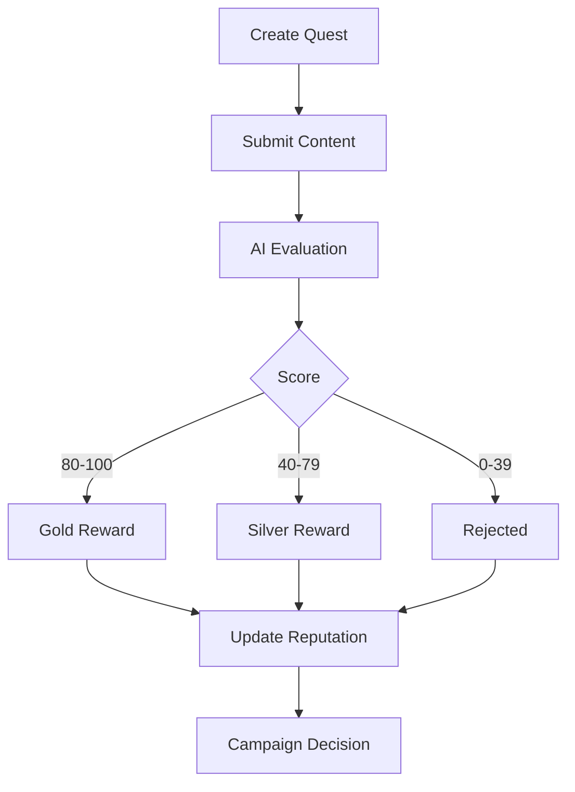

# VeriQuest

AI-Powered Trustless Quest, Reputation & Reward Protocol built on GenLayer.

VeriQuest demonstrates how Intelligent Contracts can evaluate subjective content, assign rewards, track reputation, and automate campaign decisions through decentralized AI consensus.

---

## Problem

Current quest and bounty platforms rely on centralized reviewers.

This creates:

- Reviewer bias
- Manual moderation
- Slow reward distribution
- Lack of transparency
- Limited scalability

As AI-generated content becomes more common, transparent evaluation systems become increasingly important.

---

## Solution

VeriQuest uses GenLayer Intelligent Contracts to evaluate user submissions through AI consensus.

The protocol can:

- Evaluate content quality
- Assign reward tiers
- Track contributor reputation
- Select campaign winners
- Generate campaign decisions

All results are stored on-chain.

---

## Key Features

### AI Content Evaluation

Evaluates:

- Relevance
- Quality
- Clarity
- Educational Value

### Reward Engine

Reward tiers:

- Gold
- Silver
- Rejected

### Reputation System

Tracks:

- Reputation Score
- Successful Submissions
- Failed Submissions
- Gold Rewards
- Silver Rewards

### Campaign Decision Engine

Automatically determines:

- Approved
- Review
- Rejected

campaign status.

---

## Architecture

VeriQuest consists of four modules:

### Quest Engine

Creates campaigns and stores metadata.

### AI Evaluation Engine

Scores content using GenLayer AI consensus.

### Reputation Engine

Tracks contributor performance.

### Decision Engine

Selects winners and determines campaign outcomes.

---

## Workflow

---

## Development Journey

### V1

Basic AI Evaluation Contract

### V2

Profile Tracking

### V3

Reward Logic

### V4

Category-Based Evaluation

### V5

Campaign Analytics

### V6

Winner Selection System

### V7

Reputation Protocol

---

## Deployments

| Version | Feature | Contract Address |
|----------|----------|----------|
| V1 | AI Evaluation | 0xDb248bD4bF26e9aEB14be9C7066f0007871D8F4f |
| V2 | User Profiles | 0x42F77cFb3DAf663AB2843AF9606822A5D3d9701d |
| V3 | Reward Logic | 0xE64AF422808355b83126A3961BC99063844e1713 |
| V4 | Category Evaluation | 0x5CFCaEBA8e2Cdb6205e4141bAcDCe12f1D6fc262 |
| V5 | Campaign Analytics | 0x830A777B7DcA712D8F82F6AD91908a327f4CC1A6 |
| V6 | Winner Selection | 0x0d12B68C30F80B72856310D3236CDf7D34068243 |
| V7 | Reputation Protocol | 0x82926b49cd434F7957c4e7518Dc706d51727019a |

---

## Future Roadmap

### V8

Multi-user Competition System

### V9

Escrow-Based Token Rewards

### V10

DAO Managed Campaigns

### V11

Cross-Platform Social Quests

### V12

On-Chain Reputation Marketplace

---

## Author

X (Twitter):
@cryptofunny724

GitHub:
cryptofunny2021

Built during the GenLayer Builder Program.
