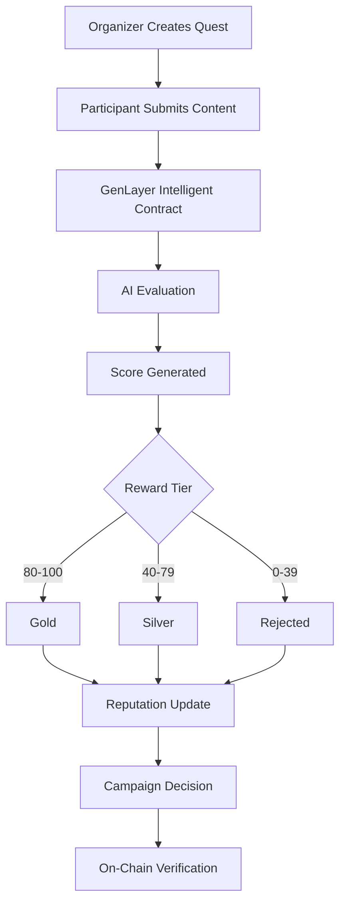

# VeriQuest

### AI-Powered Trustless Quest, Reputation & Campaign Protocol on GenLayer

VeriQuest is a decentralized protocol built on GenLayer Intelligent Contracts that enables trustless content evaluation, automated campaign decisions, reputation tracking and AI-powered reward distribution.

Instead of relying on centralized moderators, VeriQuest uses decentralized AI consensus to evaluate submissions, assign reward tiers and determine campaign outcomes.

---

## Problem

Traditional quest and bounty platforms suffer from:

* Human reviewer bias
* Slow moderation
* Expensive operations
* Limited scalability
* Lack of transparency

VeriQuest solves this by moving content evaluation directly into GenLayer Intelligent Contracts.

---

## Core Features

### AI Content Evaluation

Automatically evaluates submissions using AI reasoning.

### Reputation Engine

Tracks:

* Reputation Score
* Successful Submissions
* Failed Submissions
* Gold Rewards
* Silver Rewards

### Reward Distribution Logic

Reward Tiers:

* Gold
* Silver
* Rejected

### Campaign Decision System

Automatically determines:

* Approved
* Review Required
* Rejected

### Winner Selection

Tracks:

* Winning Submission
* Winning Score

### Category-Aware Evaluation

Supports:

* Education
* Marketing
* Research
* Community

Each category uses different AI evaluation criteria.

---

## Architecture

```text
Quest Creator
      │
      ▼
Create Campaign
      │
      ▼
Participant Submission
      │
      ▼
GenLayer AI Evaluation
      │
      ▼
Score Generation
      │
      ▼
Reward Assignment
      │
      ▼
Reputation Update
      │
      ▼
Campaign Decision
      │
      ▼
Winner Selection
```

---

## Workflow



---

## Development Evolution

| Version | Feature             |
| ------- | ------------------- |
| V1      | AI Evaluation       |
| V2      | User Profiles       |
| V3      | Reward Logic        |
| V4      | Category Evaluation |
| V5      | Campaign Analytics  |
| V6      | Winner Selection    |
| V7      | Reputation Protocol |

---

## Contract Deployments

### V1

0xDb248bD4bF26e9aEB14be9C7066f0007871D8F4f

### V2

0x42F77cFb3DAf663AB2843AF9606822A5D3d9701d

### V3

0xE64AF422808355b83126A3961BC99063844e1713

### V4

0x5CFCaEBA8e2Cdb6205e4141bAcDCe12f1D6fc262

### V5

0x830A777B7DcA712D8F82F6AD91908a327f4CC1A6

### V6

0x0d12B68C30F80B72856310D3236CDf7D34068243

### V7

0x82926b49cd434F7957c4e7518Dc706d51727019a

---

## Future Roadmap

### V8

Multi-user competition system

### V9

Escrow reward pools

### V10

DAO governance integration

### V11

Cross-campaign reputation marketplace

---

## Author

Twitter:

@cryptofunny724

Built on GenLayer Intelligent Contracts

Builder Program 2026
