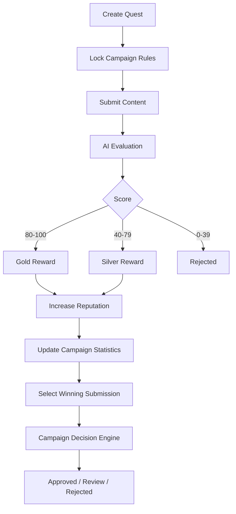

```mermaid
flowchart TD

A[Create Quest]
--> B[Lock Campaign Rules]

B --> C[Submit Content]

C --> D[AI Evaluation]

D --> E{Score}

E -->|80-100| F[Gold Reward]
E -->|40-79| G[Silver Reward]
E -->|0-39| H[Rejected]

F --> I[Increase Reputation]
G --> I

I --> J[Update Campaign Statistics]

J --> K[Select Winning Submission]

K --> L[Campaign Decision Engine]

L --> M[Approved / Review / Rejected]
```
